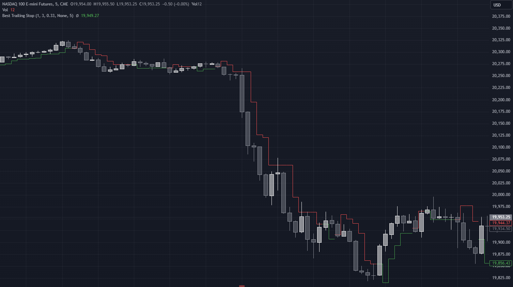
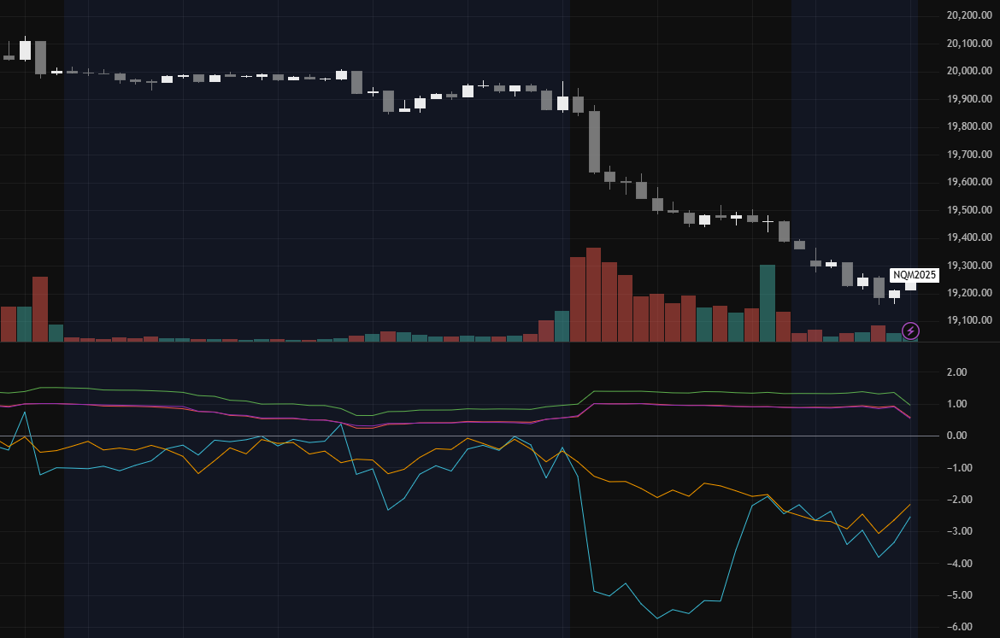
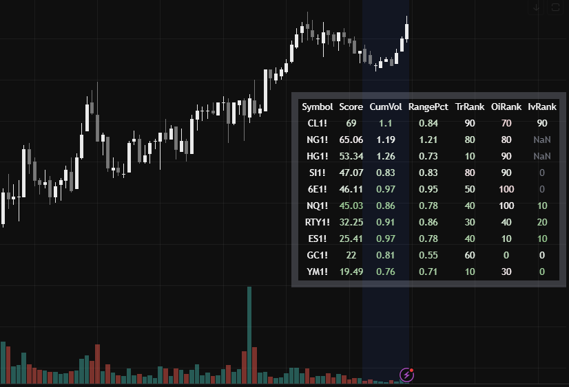

# pinescripts
Technical Analysis Tools

## Best Trailing Stop
Shows a trailing stop calculated from high/lows combined with an ATR based offset, displayed as a stepline.

## Volatility Suite
Contains several volatility indicators.
- Z-Score
- Modified Z-Score
- SQN - This uses the System Quality Number formula, but applied directly to the market prices.
- Historical Ratio - Ratio of short term volatility to long term.
- Historical Range - Normalizes short term volatility using the min/max of the long term.
- Historical Rank - Percentile rank of short term volatility in the long term.

## Futures In Play
Analyzes futures markets to identify which ones are "in play" based on various volatility and activity metrics.
Calculates a composite score for each market and analyzes how well different features predict intraday volatility.

Features:
- Cumulative Volume (CumVol) - Current day's volume relative to average
- Range Percentage (RangePct) - Current day's range relative to ATR
- True Range Rank (TrRank) - Previous day's true range percentile
- Open Interest Rank (OiRank) - Previous day's open interest percentile
- Implied Volatility Rank (IvRank) - Previous day's IV percentile (where available)

Correlation Analysis:
- Analyzes how well each feature predicts intraday volatility
- Uses either Pearson or Spearman correlation (user selectable)

