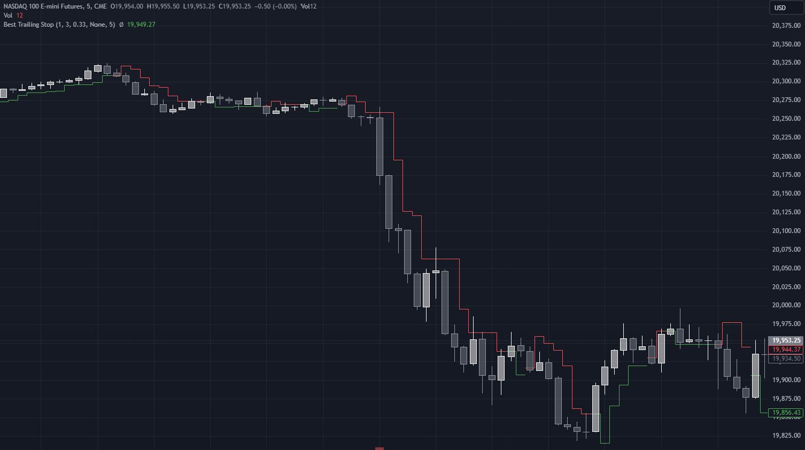

# pinescripts
Technical Analysis Tools

## Best Trailing Stop
Shows a trailing stop calculated from high/lows combined with an ATR based offset, displayed as a stepline.

## Volatility Suite
Contains several volatility indicators.
- Z-Score
- Modified Z-Score
- SQN - This uses the System Quality Number formula, but applied directly to the market prices.
- Historical Ratio - Ratio of short term volatility to long term.
- Historical Range - Normalizes short term volatility using the min/max of the long term.
- Historical Rank - Percentile rank of short term volatility in the long term.
